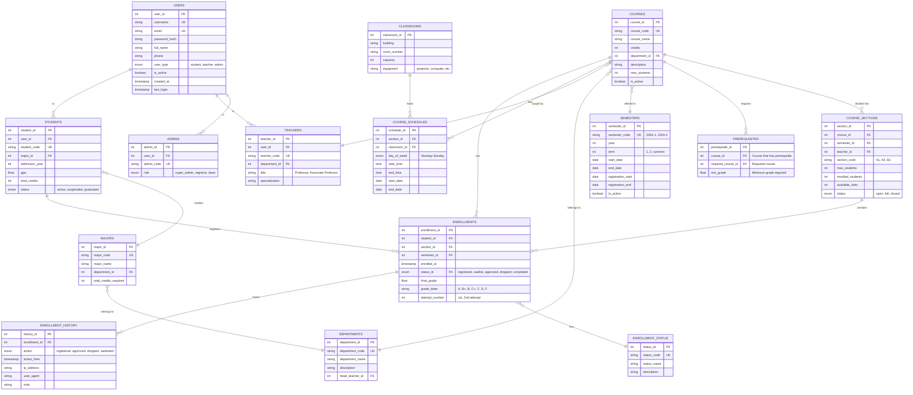
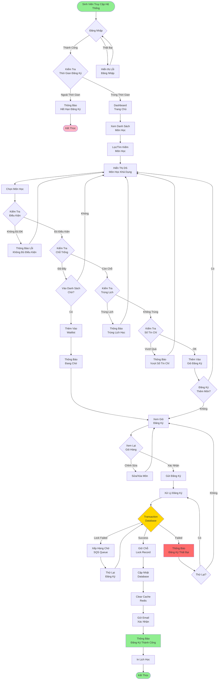
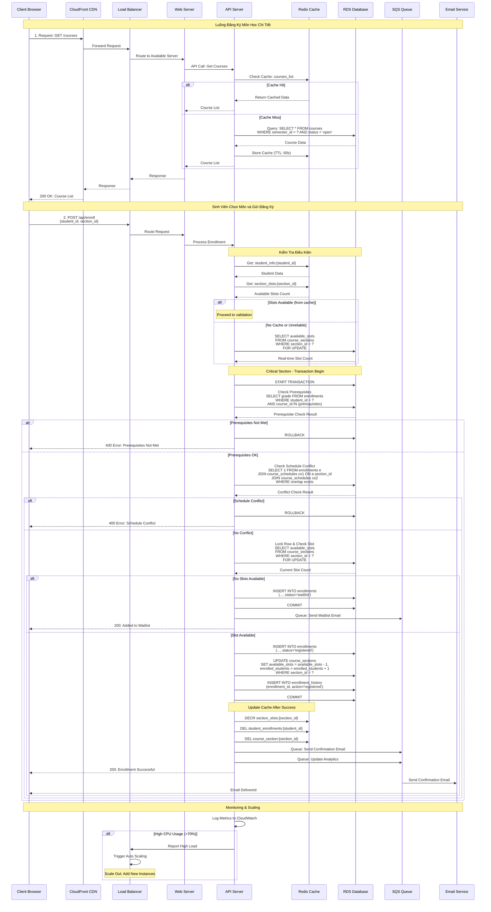
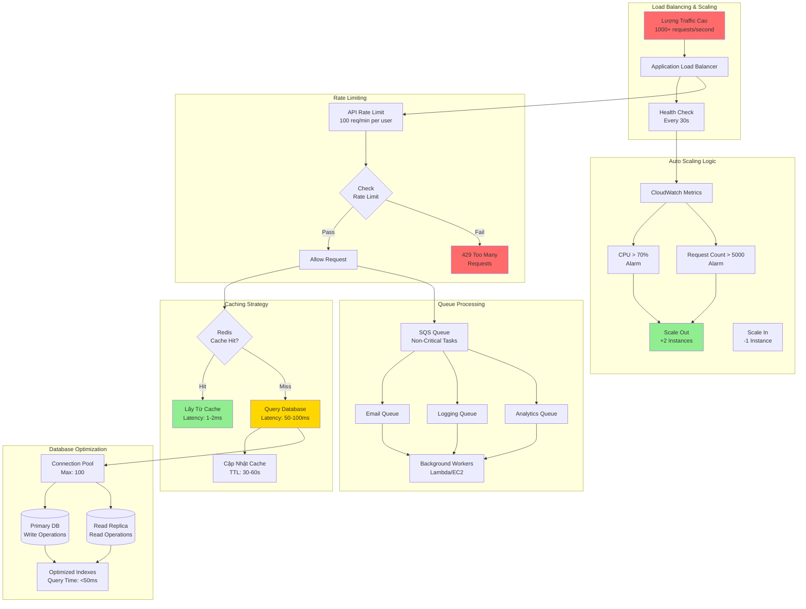
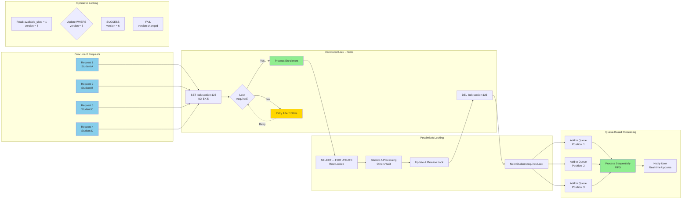

# Thiết Kế Hệ Thống Đăng Ký Môn Học - AWS Auto Scaling & Load Balancing

## Tổng Quan
Hệ thống đăng ký môn học được thiết kế để xử lý lượng truy cập cao trong thời gian đăng ký, sử dụng AWS Auto Scaling Group và Load Balancer để đảm bảo tính khả dụng và hiệu năng.

---

## 1. Sơ Đồ Kiến Trúc Hệ Thống (System Architecture)

```mermaid
flowchart TB
    subgraph Users["Người Dùng"]
        SV[Sinh Viên]
        GV[Giảng Viên]
        AD[Quản Trị Viên]
    end

    subgraph CloudFront["AWS CloudFront CDN"]
        CF[Content Delivery Network]
    end

    subgraph Route53["AWS Route 53"]
        DNS[DNS Management]
    end

    subgraph VPC["AWS VPC"]
        subgraph PublicSubnet["Public Subnet - Multi AZ"]
            subgraph ALB["Application Load Balancer"]
                LB[ALB - Health Check Enabled]
            end
            
            subgraph NAT["NAT Gateway"]
                NATGW[NAT Gateway]
            end
        end

        subgraph PrivateSubnet["Private Subnet - Multi AZ"]
            subgraph ASG["Auto Scaling Group"]
                WS1[Web Server 1<br/>EC2 Instance]
                WS2[Web Server 2<br/>EC2 Instance]
                WS3[Web Server 3<br/>EC2 Instance]
                WSN[Web Server N<br/>Auto Scale]
            end
            
            subgraph AppServers["Application Servers"]
                AS1[App Server 1<br/>Backend API]
                AS2[App Server 2<br/>Backend API]
            end
        end

        subgraph DataLayer["Data Layer - Multi AZ"]
            subgraph RDS["Amazon RDS"]
                DB1[(Primary DB<br/>MySQL/PostgreSQL)]
                DB2[(Standby DB<br/>Read Replica)]
            end
            
            subgraph Cache["ElastiCache"]
                REDIS[Redis Cluster<br/>Session & Cache]
            end
            
            subgraph Queue["SQS Queue"]
                SQS[Message Queue<br/>Async Processing]
            end
        end
    end

    subgraph Storage["Storage Services"]
        S3[S3 Bucket<br/>Static Assets]
        S3Backup[S3 Backup<br/>Database Backups]
    end

    subgraph Monitoring["Monitoring & Logging"]
        CW[CloudWatch<br/>Metrics & Alarms]
        CWL[CloudWatch Logs<br/>Application Logs]
        SNS[SNS<br/>Notifications]
    end

    Users --> DNS
    DNS --> CF
    CF --> LB
    LB --> WS1 & WS2 & WS3 & WSN
    WS1 & WS2 & WS3 & WSN --> AS1 & AS2
    AS1 & AS2 --> DB1
    AS1 & AS2 --> REDIS
    AS1 & AS2 --> SQS
    DB1 --> DB2
    WS1 & WS2 --> S3
    DB1 -.Backup.-> S3Backup
    
    ASG --> CW
    CW --> SNS
    LB --> CWL
    AS1 & AS2 --> CWL

    style ALB fill:#FF9900
    style ASG fill:#FF9900
    style RDS fill:#527FFF
    style Cache fill:#C925D1
    style Users fill:#232F3E
    style Monitoring fill:#FF9900
```



### Giải Thích Kiến Trúc:

#### **Lớp Client (Users)**
- **Sinh viên**: Đăng ký, xem lịch học, hủy môn
- **Giảng viên**: Quản lý môn học, xem danh sách sinh viên
- **Quản trị viên**: Quản lý hệ thống, cấu hình môn học

#### **Lớp CDN & DNS**
- **CloudFront**: Cache nội dung tĩnh, giảm latency
- **Route 53**: Quản lý DNS, health check, failover

#### **Lớp Load Balancing**
- **Application Load Balancer**: 
  - Phân phối traffic đều giữa các web servers
  - Health check tự động
  - SSL/TLS termination
  - Sticky sessions cho session management

#### **Lớp Application (Auto Scaling)**
- **Auto Scaling Group**:
  - Min: 2 instances (High Availability)
  - Max: 10-20 instances (tùy theo nhu cầu)
  - Scaling Policy: CPU > 70% hoặc Request Count
  - Multi-AZ deployment
- **Web Servers**: Nginx/Apache + React/Vue.js
- **App Servers**: Node.js/Python/Java backend API

#### **Lớp Data**
- **RDS**: 
  - Primary DB cho write operations
  - Read Replica cho read operations (phân tải)
  - Multi-AZ cho high availability
  - Automated backups
- **ElastiCache Redis**: 
  - Session storage
  - Cache dữ liệu môn học
  - Cache số lượng chỗ còn lại
- **SQS**: Xử lý async tasks (email notifications, logging)

#### **Lớp Storage**
- **S3**: Lưu trữ static assets (CSS, JS, images)
- **S3 Backup**: Backup database định kỳ

#### **Monitoring**
- **CloudWatch**: Metrics, alarms, auto-scaling triggers
- **CloudWatch Logs**: Centralized logging
- **SNS**: Alert notifications

---

## 2. Sơ Đồ Cơ Sở Dữ Liệu (Database Schema)



### Indexes Quan Trọng:
```sql
-- High-traffic queries optimization
CREATE INDEX idx_enrollments_student_semester ON ENROLLMENTS(student_id, semester_id);
CREATE INDEX idx_enrollments_section_status ON ENROLLMENTS(section_id, status_id);
CREATE INDEX idx_course_sections_semester_status ON COURSE_SECTIONS(semester_id, status);
CREATE INDEX idx_users_username_active ON USERS(username, is_active);
CREATE INDEX idx_enrollment_history_time ON ENROLLMENT_HISTORY(action_time);

-- Composite indexes for complex queries
CREATE INDEX idx_students_major_status ON STUDENTS(major_id, status);
CREATE INDEX idx_courses_dept_active ON COURSES(department_id, is_active);
```

---

## 3. Sơ Đồ Luồng Đăng Ký Môn Học (User Flow & Data Flow)

### 3.1. Luồng Người Dùng - Đăng Ký Môn Học



### 3.2. Luồng Dữ Liệu - Backend Processing



### 3.3. Luồng Xử Lý Khi Tải Cao (High Traffic Scenario)



### 3.4. Luồng Xử Lý Đồng Thời (Concurrency Control)



---

## 4. Chi Tiết Kỹ Thuật Implementation

### 4.1. Auto Scaling Configuration

```json
{
  "AutoScalingGroup": {
    "MinSize": 2,
    "MaxSize": 20,
    "DesiredCapacity": 4,
    "HealthCheckType": "ELB",
    "HealthCheckGracePeriod": 300,
    "VPCZoneIdentifier": ["subnet-private-1a", "subnet-private-1b"],
    "TargetGroupARNs": ["arn:aws:elasticloadbalancing:..."],
    "ScalingPolicies": [
      {
        "PolicyName": "scale-out-cpu",
        "AdjustmentType": "ChangeInCapacity",
        "ScalingAdjustment": 2,
        "Cooldown": 300,
        "MetricAggregationType": "Average",
        "TargetTrackingConfiguration": {
          "PredefinedMetricType": "ASGAverageCPUUtilization",
          "TargetValue": 70.0
        }
      },
      {
        "PolicyName": "scale-out-request-count",
        "TargetTrackingConfiguration": {
          "PredefinedMetricType": "ALBRequestCountPerTarget",
          "TargetValue": 5000
        }
      }
    ]
  }
}
```

### 4.2. Load Balancer Configuration

```json
{
  "LoadBalancer": {
    "Type": "application",
    "Scheme": "internet-facing",
    "IpAddressType": "ipv4",
    "Subnets": ["subnet-public-1a", "subnet-public-1b"],
    "SecurityGroups": ["sg-alb"],
    "Listeners": [
      {
        "Protocol": "HTTPS",
        "Port": 443,
        "SslPolicy": "ELBSecurityPolicy-TLS-1-2-2017-01",
        "Certificates": [{"CertificateArn": "arn:aws:acm:..."}],
        "DefaultActions": [
          {
            "Type": "forward",
            "TargetGroupArn": "arn:aws:elasticloadbalancing:..."
          }
        ]
      }
    ],
    "TargetGroup": {
      "Protocol": "HTTP",
      "Port": 80,
      "HealthCheck": {
        "Protocol": "HTTP",
        "Path": "/health",
        "Interval": 30,
        "Timeout": 5,
        "HealthyThreshold": 2,
        "UnhealthyThreshold": 3
      },
      "Stickiness": {
        "Enabled": true,
        "Type": "lb_cookie",
        "DurationSeconds": 3600
      }
    }
  }
}
```

### 4.3. Redis Cache Strategy

```javascript
// Cache key patterns
const CACHE_KEYS = {
  courseList: (semesterId) => `courses:semester:${semesterId}`,
  courseDetail: (courseId) => `course:${courseId}`,
  sectionSlots: (sectionId) => `section:slots:${sectionId}`,
  studentEnrollments: (studentId) => `student:enrollments:${studentId}`,
  sessionData: (sessionId) => `session:${sessionId}`
};

// TTL Strategy
const CACHE_TTL = {
  courseList: 300,        // 5 minutes - moderate changes
  courseDetail: 3600,     // 1 hour - rarely changes
  sectionSlots: 30,       // 30 seconds - frequently changes
  studentEnrollments: 60, // 1 minute - moderate changes
  sessionData: 1800       // 30 minutes - session timeout
};

// Example: Get available slots with cache
async function getAvailableSlots(sectionId) {
  const cacheKey = CACHE_KEYS.sectionSlots(sectionId);
  
  // Try cache first
  let slots = await redis.get(cacheKey);
  
  if (slots === null) {
    // Cache miss - query database
    slots = await db.query(
      'SELECT available_slots FROM course_sections WHERE section_id = ?',
      [sectionId]
    );
    
    // Store in cache with short TTL (high volatility)
    await redis.setex(cacheKey, CACHE_TTL.sectionSlots, slots);
  }
  
  return slots;
}

// Invalidate cache after enrollment
async function invalidateCacheAfterEnrollment(studentId, sectionId) {
  const keys = [
    CACHE_KEYS.sectionSlots(sectionId),
    CACHE_KEYS.studentEnrollments(studentId)
  ];
  
  await redis.del(...keys);
}
```

### 4.4. Database Transaction - Enrollment

```sql
-- Optimized enrollment transaction with proper locking
START TRANSACTION;

-- 1. Lock the section row to prevent race conditions
SELECT 
    section_id,
    available_slots,
    max_students,
    enrolled_students
FROM course_sections
WHERE section_id = ?
FOR UPDATE;

-- 2. Check if slots available
-- This check is done in application code after locking

-- 3. Check prerequisites (if applicable)
SELECT COUNT(*) as met_prerequisites
FROM prerequisites p
LEFT JOIN enrollments e ON (
    e.student_id = ? 
    AND e.course_id = p.required_course_id
    AND e.grade_letter IN ('A', 'B+', 'B', 'C+', 'C')
    AND e.status_id = 'completed'
)
WHERE p.course_id = (
    SELECT course_id FROM course_sections WHERE section_id = ?
)
GROUP BY p.course_id
HAVING COUNT(p.prerequisite_id) = COUNT(e.enrollment_id);

-- 4. Check schedule conflicts
SELECT COUNT(*) as conflicts
FROM enrollments e1
JOIN course_sections cs1 ON e1.section_id = cs1.section_id
JOIN course_schedules sch1 ON cs1.section_id = sch1.section_id
JOIN course_schedules sch2 ON sch2.section_id = ?
WHERE e1.student_id = ?
  AND e1.semester_id = cs1.semester_id
  AND sch1.day_of_week = sch2.day_of_week
  AND (
    (sch1.start_time <= sch2.start_time AND sch1.end_time > sch2.start_time)
    OR
    (sch1.start_time < sch2.end_time AND sch1.end_time >= sch2.end_time)
  );

-- 5. If all checks pass, insert enrollment
INSERT INTO enrollments (
    student_id,
    section_id,
    semester_id,
    enrolled_at,
    status_id,
    attempt_number
) VALUES (
    ?,
    ?,
    (SELECT semester_id FROM course_sections WHERE section_id = ?),
    NOW(),
    'registered',
    1
);

-- 6. Update section counts
UPDATE course_sections
SET 
    enrolled_students = enrolled_students + 1,
    available_slots = available_slots - 1,
    status = CASE 
        WHEN available_slots - 1 <= 0 THEN 'full'
        ELSE 'open'
    END
WHERE section_id = ?;

-- 7. Log the enrollment action
INSERT INTO enrollment_history (
    enrollment_id,
    action,
    action_time,
    ip_address,
    user_agent
) VALUES (
    LAST_INSERT_ID(),
    'registered',
    NOW(),
    ?,
    ?
);

COMMIT;
```

### 4.5. API Endpoints

```javascript
// Core API Endpoints

// Authentication
POST   /api/auth/login              // Login
POST   /api/auth/logout             // Logout
POST   /api/auth/refresh            // Refresh token
GET    /api/auth/me                 // Get current user

// Courses
GET    /api/courses                 // List all courses (with filters)
GET    /api/courses/:id             // Get course detail
GET    /api/courses/:id/sections    // Get course sections
GET    /api/sections/:id            // Get section detail
GET    /api/sections/:id/schedule   // Get section schedule

// Enrollment
POST   /api/enrollments             // Register for course
DELETE /api/enrollments/:id         // Drop course
GET    /api/enrollments/my          // Get my enrollments
POST   /api/enrollments/waitlist    // Join waitlist
GET    /api/enrollments/:id/status  // Check enrollment status

// Student
GET    /api/students/me             // Get student profile
GET    /api/students/me/schedule    // Get my schedule
GET    /api/students/me/transcript  // Get transcript
PUT    /api/students/me             // Update profile

// Admin
GET    /api/admin/enrollments      // View all enrollments
PUT    /api/admin/enrollments/:id  // Approve/reject enrollment
GET    /api/admin/statistics       // Get system statistics
POST   /api/admin/sections         // Create new section

// Health & Monitoring
GET    /health                     // Health check for ALB
GET    /metrics                    // Prometheus metrics
```

### 4.6. Monitoring & Alerts

```yaml
# CloudWatch Alarms Configuration
Alarms:
  - Name: HighCPUUtilization
    Metric: CPUUtilization
    Threshold: 70
    Period: 300
    EvaluationPeriods: 2
    Action: ScaleOut + SNS Notification

  - Name: HighRequestCount
    Metric: RequestCount
    Threshold: 10000
    Period: 60
    EvaluationPeriods: 1
    Action: ScaleOut + SNS Notification

  - Name: High5XXErrors
    Metric: HTTPCode_Target_5XX_Count
    Threshold: 10
    Period: 60
    EvaluationPeriods: 2
    Action: SNS Notification to DevOps

  - Name: HighDatabaseConnections
    Metric: DatabaseConnections
    Threshold: 80
    Period: 300
    EvaluationPeriods: 1
    Action: SNS Notification

  - Name: LowAvailableSlots
    Custom Metric: AvailableSlots
    Threshold: 10
    Period: 60
    Action: Log to CloudWatch + Alert Admins

# Dashboard Widgets
Dashboard:
  - Widget: RequestCount (per minute)
  - Widget: ActiveInstances (ASG)
  - Widget: CPUUtilization (average)
  - Widget: ResponseTime (p50, p95, p99)
  - Widget: DatabaseConnections
  - Widget: CacheHitRate (Redis)
  - Widget: EnrollmentSuccessRate
```

---

## 5. Kế Hoạch Triển Khai (Deployment Plan)

### Phase 1: Infrastructure Setup (Week 1-2)
- [ ] Thiết lập VPC, Subnets, Security Groups
- [ ] Cấu hình RDS Database (Multi-AZ)
- [ ] Cấu hình ElastiCache Redis Cluster
- [ ] Thiết lập S3 Buckets
- [ ] Cấu hình CloudWatch Logging

### Phase 2: Application Deployment (Week 3-4)
- [ ] Deploy Backend API lên EC2 instances
- [ ] Cấu hình Load Balancer
- [ ] Thiết lập Auto Scaling Group
- [ ] Deploy Frontend lên S3 + CloudFront
- [ ] Cấu hình Route 53

### Phase 3: Testing (Week 5)
- [ ] Unit Testing
- [ ] Integration Testing
- [ ] Load Testing (JMeter/Locust)
- [ ] Security Testing
- [ ] Penetration Testing

### Phase 4: Optimization (Week 6)
- [ ] Database Query Optimization
- [ ] Cache Strategy Tuning
- [ ] Auto Scaling Policy Adjustment
- [ ] Performance Monitoring Setup

### Phase 5: Go-Live (Week 7)
- [ ] Soft Launch (Limited Users)
- [ ] Monitor System Performance
- [ ] Full Launch
- [ ] 24/7 Monitoring & Support

---

## 6. Ước Tính Chi Phí AWS (Monthly)

### Scenario 1: Normal Load (1000 students)
- **EC2 (t3.medium x 4 instances)**: $120
- **RDS (db.t3.large Multi-AZ)**: $280
- **ElastiCache (cache.t3.medium)**: $70
- **Load Balancer**: $25
- **CloudFront**: $15
- **S3**: $5
- **CloudWatch**: $10
- **Data Transfer**: $30
- **Total**: ~$555/month

### Scenario 2: High Load (10,000 students, registration period)
- **EC2 (t3.large x 12 instances)**: $600
- **RDS (db.r5.xlarge Multi-AZ)**: $800
- **ElastiCache (cache.r5.large cluster)**: $220
- **Load Balancer**: $50
- **CloudFront**: $80
- **S3**: $20
- **CloudWatch**: $30
- **Data Transfer**: $150
- **Total**: ~$1,950/month

---

## 7. Best Practices & Recommendations

### 7.1. Security
✅ Use HTTPS everywhere (SSL/TLS)
✅ Implement rate limiting per user
✅ Use AWS WAF to prevent DDoS
✅ Enable MFA for admin accounts
✅ Encrypt data at rest (RDS encryption)
✅ Regular security audits
✅ Use AWS Secrets Manager for credentials

### 7.2. Performance
✅ Use CloudFront CDN for static assets
✅ Implement aggressive caching strategy
✅ Use database connection pooling
✅ Optimize database queries with proper indexes
✅ Use async processing for non-critical tasks
✅ Implement pagination for large result sets
✅ Use compression (gzip) for API responses

### 7.3. Reliability
✅ Multi-AZ deployment for high availability
✅ Automated backups (daily)
✅ Health checks for all services
✅ Graceful degradation during failures
✅ Circuit breaker pattern for external services
✅ Disaster recovery plan

### 7.4. Scalability
✅ Stateless application design
✅ Horizontal scaling over vertical
✅ Use SQS for decoupling services
✅ Database read replicas
✅ Auto-scaling based on metrics
✅ Load testing before registration period

### 7.5. Monitoring
✅ Real-time monitoring dashboard
✅ Alert thresholds for critical metrics
✅ Application performance monitoring (APM)
✅ Log aggregation and analysis
✅ User behavior analytics
✅ Incident response procedures

---

## 8. Tech Stack Recommendation

### Frontend
- **Framework**: React.js / Vue.js / Next.js
- **UI Library**: Material-UI / Ant Design
- **State Management**: Redux / Zustand
- **HTTP Client**: Axios
- **WebSocket**: Socket.io (real-time updates)

### Backend
- **Runtime**: Node.js / Python (FastAPI) / Java (Spring Boot)
- **API**: RESTful / GraphQL
- **Authentication**: JWT + OAuth2
- **Validation**: Joi / Pydantic
- **ORM**: Sequelize / TypeORM / SQLAlchemy

### Database
- **Primary**: PostgreSQL / MySQL (RDS)
- **Cache**: Redis (ElastiCache)
- **Search**: Elasticsearch (optional)

### DevOps
- **CI/CD**: GitHub Actions / GitLab CI
- **IaC**: Terraform / CloudFormation
- **Containers**: Docker
- **Orchestration**: ECS / EKS (optional)

---

## 9. Tài Liệu Tham Khảo

- [AWS Auto Scaling Documentation](https://docs.aws.amazon.com/autoscaling/)
- [AWS Application Load Balancer](https://docs.aws.amazon.com/elasticloadbalancing/)
- [AWS RDS Best Practices](https://docs.aws.amazon.com/AmazonRDS/latest/UserGuide/CHAP_BestPractices.html)
- [Redis Caching Strategies](https://redis.io/docs/manual/patterns/)
- [Database Concurrency Control](https://dev.mysql.com/doc/refman/8.0/en/innodb-locking.html)

---

**Lưu Ý**: Đây là thiết kế tham khảo. Trong thực tế cần điều chỉnh dựa trên:
- Số lượng sinh viên thực tế
- Ngân sách dự án
- Yêu cầu cụ thể của trường
- Quy mô môn học và lịch học
- Thời gian đăng ký (concurrent users)

**Version**: 1.0  
**Last Updated**: November 14, 2025  
**Author**: System Architecture Team
